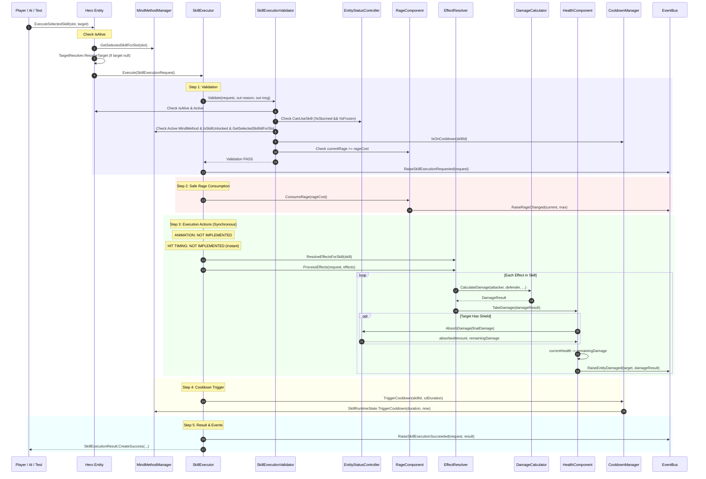

# P07.9 PRE-IMPLEMENTATION AUDIT
**Milestone:** P07.9 — Advanced Skill Casting / Cast Time / Channel / Interrupt  
**Project:** `E:\code\TLTD`  
**Status:** AUDIT ONLY — ZERO CODE MODIFICATION — ZERO GAMEPLAY CHANGE — ZERO NEW DESIGN DECISION  
**Date of Audit:** 2026-09-11  

---

## 1. Executive Summary

1. **P07.9 Current Status in Code:** **0% Implemented.** There is currently **no cast time**, **no channel duration**, **no channel tick loop**, and **no skill cast interruption** logic in the codebase. All skill executions are 100% synchronous and instantaneous within a single frame.
2. **Current Combat Baseline:** P01 through P07.8 are fully implemented and locked according to `PROJECT_MEMORY`. P07.6 (Debuff / CC / Resistance / Anti-CC), P07.7 (Cleanse / Dispel), and P07.8 (Shield / Barrier) have solid, authoritative architectures centered on [EntityStatusController](file:///E:/code/TLTD/Assets/_Game/Combat/EntityStatusController.cs).
3. **Interruption Mechanics Today:** [EntityStatusController](file:///E:/code/TLTD/Assets/_Game/Combat/EntityStatusController.cs) applies Stun and Freeze and invokes `OwnerEntity.InterruptCurrentAction()`. In [Entity](file:///E:/code/TLTD/Assets/_Game/Entities/Entity.cs), `InterruptCurrentAction()` only resets `AttackComponent.ResetAttackTimer()`. Because active skills execute in 0 frames, there has never been an active skill to interrupt.
4. **P07.9 Objective:** Introduce non-instantaneous skills (Cast Time, Channeling, Interruptibility) without breaking the existing instantaneous skill flow (`CastTime = 0`), without violating headless automated test determinism, and without duplicating authorities established in P07.6, P07.7, and P07.8.

---

## 2. Current Architecture

The combat and progression architecture currently divides responsibilities cleanly across specialized components:

| Feature / Responsibility | Authoritative Class | Key Methods / Properties | Authority Boundary |
|---|---|---|---|
| **Skill Execution** | [SkillExecutor](file:///E:/code/TLTD/Assets/_Game/Combat/SkillExecutor.cs) (`ISkillExecutor`) | `ExecuteSkill(request)`, `Execute(request)` | Sole authority for executing skill requests. |
| **Skill Validation** | [SkillExecutionValidator](file:///E:/code/TLTD/Assets/_Game/Combat/SkillExecutionValidator.cs) | `Validate(request, out reason, out msg)` | Validates entity life, CC permissions, mind method match, unlock state, target validity, cooldown, and rage. |
| **Skill Cooldown** | [CooldownManager](file:///E:/code/TLTD/Assets/_Game/Combat/CooldownManager.cs) & [MindMethodManager](file:///E:/code/TLTD/Assets/_Game/Progression/MindMethodManager.cs) | `IsOnCooldown`, `TriggerCooldown`, `GetRemainingCooldown` | Sole authority for tracking skill cooldowns using `ITimeProvider`. |
| **Skill State** | [SkillRuntimeState](file:///E:/code/TLTD/Assets/_Game/Progression/MindMethodManager.cs#L12) | `IsUnlocked`, `SkillLevel`, `CooldownEndTime` | Tracks unlock and cooldown state. **No casting/channeling states exist.** |
| **Cast Timing** | **NOT IMPLEMENTED** | N/A | Current skills execute instantaneously in 1 call frame. |
| **Animation Timing** | **NOT IMPLEMENTED** | N/A | No Unity Animator/Animation event pipeline exists in C# code. Headless/code-driven timing only. |
| **Hit Timing** | **NOT IMPLEMENTED** | N/A | Effect application occurs synchronously immediately upon `SkillExecutor.ExecuteSkill`. |
| **Interrupt Authority** | [EntityStatusController](file:///E:/code/TLTD/Assets/_Game/Combat/EntityStatusController.cs#L256) & [Entity](file:///E:/code/TLTD/Assets/_Game/Entities/Entity.cs#L91) | `InterruptCurrentAction()`, `EventBus.RaiseCrowdControlInterrupted` | Stun & Freeze call `InterruptCurrentAction()` which resets `AttackComponent.ResetAttackTimer()`. |
| **Crowd Control (CC)** | [EntityStatusController](file:///E:/code/TLTD/Assets/_Game/Combat/EntityStatusController.cs) | `ApplyCrowdControl`, `RemoveCrowdControl`, `HasActiveCrowdControl` | Sole authority for CC instances, duration scaling via `CcResistance`, and anti-CC immunity. |
| **Stun** | [EntityStatusController](file:///E:/code/TLTD/Assets/_Game/Combat/EntityStatusController.cs) | `IsStunned`, blocks `CanMove`, `CanBasicAttack`, `CanUseSkill`, `CanUseUltimate`, `CanDash` | Sets action permissions to false, triggers `InterruptCurrentAction()`. |
| **Root** | [EntityStatusController](file:///E:/code/TLTD/Assets/_Game/Combat/EntityStatusController.cs) | `IsRooted`, blocks `CanMove`, `CanDash` | Allows Basic Attack, Skills, and Ultimate. Does NOT trigger interruption. |
| **Freeze** | [EntityStatusController](file:///E:/code/TLTD/Assets/_Game/Combat/EntityStatusController.cs) | `IsFrozen`, blocks all actions, `TryTriggerFreezeShatter` | Blocks all 5 action permissions, triggers `InterruptCurrentAction()`. |
| **Anti-CC Immunity** | [EntityStatusController](file:///E:/code/TLTD/Assets/_Game/Combat/EntityStatusController.cs#L87) | `HasAntiCCImmunity`, `ApplyAntiCCImmunity` | Evaluated before CC application and before resistance calculation. |
| **Rage Management** | [RageComponent](file:///E:/code/TLTD/Assets/_Game/Entities/Components/RageComponent.cs) | `AddRage`, `ConsumeRage`, `CurrentRage`, `MaxRage` | Sole authority for entity resource. Safely consumed in `SkillExecutor` step 2. |
| **Basic Attack** | [AttackComponent](file:///E:/code/TLTD/Assets/_Game/Entities/Components/AttackComponent.cs) & [BasicAttackProcessor](file:///E:/code/TLTD/Assets/_Game/Combat/BasicAttackProcessor.cs) | `ManualTick(dt)`, `ExecuteBasicAttack` | Ticks attack interval, calculates damage, triggers rage gains, checks target range. |
| **Ultimate Skill** | [Hero](file:///E:/code/TLTD/Assets/_Game/Entities/Hero.cs#L295) & [SkillExecutor](file:///E:/code/TLTD/Assets/_Game/Combat/SkillExecutor.cs) | `ExecuteSelectedSkill(SkillSlotType.Ultimate)` | Handled through common skill pipeline; consumed via `SkillDefinitionSO.RageCost`. |
| **Battle State** | [BattleManager](file:///E:/code/TLTD/Assets/_Game/Core/BattleManager.cs) & [EventBus](file:///E:/code/TLTD/Assets/_Game/Core/EventBus.cs) | `BattleState`, `IsBattleActive`, `StartBattle` | Controls combat active state, monster encounters, victory/defeat. |
| **Entity Health & Death** | [HealthComponent](file:///E:/code/TLTD/Assets/_Game/Entities/Components/HealthComponent.cs) | `TakeDamage(DamageResult)`, `Heal`, `Die` | Sole authority for HP deduction, MindMethod revive check, and death triggers. |
| **Damage Calculation** | [DamageCalculator](file:///E:/code/TLTD/Assets/_Game/Combat/DamageCalculator.cs) | `CalculateDamage`, `CalculateDotDamage` | Sole authority for Dodge, Defense modifier, Crit, Outgoing Damage modifiers, Freeze Shatter. |
| **Shield & Barrier** | [EntityStatusController](file:///E:/code/TLTD/Assets/_Game/Combat/EntityStatusController.cs#L658) | `ApplyShield`, `AbsorbDamage`, `TotalShieldAmount` | Sole runtime authority for shields. Intercepts damage in `HealthComponent.TakeDamage`. |
| **Cleanse & Dispel** | [EntityStatusController](file:///E:/code/TLTD/Assets/_Game/Combat/EntityStatusController.cs#L910) | `Cleanse`, `Dispel` | Sole authority for status/CC removal. Cleansing CC immediately restores permissions. |
| **Global Events** | [EventBus](file:///E:/code/TLTD/Assets/_Game/Core/EventBus.cs) | Static event broker | Emits combat, progression, CC, cleanse, shield, and skill events. |

### Authorities That MUST NOT Be Duplicated
1. **`EntityStatusController`:** Sole authority for CC state, status effects, and shields. P07.9 must query `EntityStatusController` and MUST NOT create a separate CC tracking mechanism.
2. **`DamageCalculator`:** Sole authority for damage formulas. P07.9 cast/channel damage MUST pass through `DamageCalculator.CalculateDamage` or `CalculateDotDamage`.
3. **`HealthComponent`:** Sole authority for HP loss and death. P07.9 cannot decrement `currentHealth` directly.
4. **`CooldownManager`:** Sole authority for cooldown tracking. P07.9 cannot introduce private cooldown timers.
5. **`RageComponent`:** Sole authority for Rage. P07.9 must consume/refund via `RageComponent`.

---

## 3. Skill Execution Call Graph

Trace of a complete skill execution in current code:



### Detailed Trace Data Table

| Step | File | Class | Method | Caller | Callee | State Change | Authority Owner |
|---|---|---|---|---|---|---|---|
| **1. Trigger** | [Hero.cs](file:///E:/code/TLTD/Assets/_Game/Entities/Hero.cs#L295) | `Hero` | `ExecuteSelectedSkill` | AI / Player / Test | `MindMethodManager.GetSelectedSkillForSlot`, `SkillExecutor.Execute` | `CurrentTarget` updated | `Hero` |
| **2. Target Resolution** | [TargetResolver.cs](file:///E:/code/TLTD/Assets/_Game/Combat/TargetResolver.cs#L17) | `NearestEnemyTargetResolver` | `ResolveTarget` | `Hero.ExecuteSelectedSkill` | `Object.FindObjectsByType<Entity>` | None (query) | `TargetResolver` |
| **3. Request Start** | [SkillExecutor.cs](file:///E:/code/TLTD/Assets/_Game/Combat/SkillExecutor.cs#L30) | `SkillExecutor` | `ExecuteSkill` | `Hero` | `SkillExecutionValidator.Validate` | None | `SkillExecutor` |
| **4. Validation** | [SkillExecutionValidator.cs](file:///E:/code/TLTD/Assets/_Game/Combat/SkillExecutionValidator.cs#L10) | `SkillExecutionValidator` | `Validate` | `SkillExecutor.ExecuteSkill` | `Entity.CanUseSkill`, `MindMethodManager`, `CooldownManager` | None (query) | `SkillExecutionValidator` |
| **5. Rage Consumption** | [RageComponent.cs](file:///E:/code/TLTD/Assets/_Game/Entities/Components/RageComponent.cs#L60) | `RageComponent` | `ConsumeRage` | `SkillExecutor.ExecuteSkill` | `NotifyRageChanged` | `currentRage -= rageCost` | `RageComponent` |
| **6. Animation** | **NOT IMPLEMENTED** | N/A | N/A | N/A | N/A | None | NOT IMPLEMENTED |
| **7. Hit Timing** | **NOT IMPLEMENTED** | N/A | N/A | N/A | N/A | None (instantaneous) | NOT IMPLEMENTED |
| **8. Effect Resolution** | [EffectResolver.cs](file:///E:/code/TLTD/Assets/_Game/Combat/EffectResolver.cs#L62) | `EffectResolver` | `ResolveEffectsForSkill` | `SkillExecutor.ExecuteSkill` | Resolves SO definitions or fallback | None (query) | `EffectResolver` |
| **9. Effect Processing** | [EffectResolver.cs](file:///E:/code/TLTD/Assets/_Game/Combat/EffectResolver.cs#L25) | `EffectResolver` | `ProcessEffects` | `SkillExecutor.ExecuteSkill` | `SkillEffectDefinitionSO.Execute` | None | `EffectResolver` |
| **10. Damage Calc** | [DamageCalculator.cs](file:///E:/code/TLTD/Assets/_Game/Combat/DamageCalculator.cs#L10) | `DamageCalculator` | `CalculateDamage` | `DamageEffectDefinitionSO.Execute` | Random dodge, crit, defense mod | None (pure function) | `DamageCalculator` |
| **11. Shield Absorb** | [EntityStatusController.cs](file:///E:/code/TLTD/Assets/_Game/Combat/EntityStatusController.cs#L791) | `EntityStatusController` | `AbsorbDamage` | `HealthComponent.TakeDamage` | Modifies active shield instances | `shield.CurrentAmount` reduced | `EntityStatusController` |
| **12. Damage Apply** | [HealthComponent.cs](file:///E:/code/TLTD/Assets/_Game/Entities/Components/HealthComponent.cs#L87) | `HealthComponent` | `TakeDamage` | `DamageEffectDefinitionSO.Execute` | `OnHealthChanged`, `Die` | `currentHealth -= remDmg` | `HealthComponent` |
| **13. Event Emitted** | [EventBus.cs](file:///E:/code/TLTD/Assets/_Game/Core/EventBus.cs#L101) | `EventBus` | `RaiseEntityDamaged` | `HealthComponent.TakeDamage` | UI / Audio / Test listeners | None | `EventBus` |
| **14. Cooldown Start** | [CooldownManager.cs](file:///E:/code/TLTD/Assets/_Game/Combat/CooldownManager.cs#L122) | `CooldownManager` | `TriggerCooldown` | `SkillExecutor.ExecuteSkill` | `SkillRuntimeState.TriggerCooldown` | `CooldownEndTime = now + duration` | `CooldownManager` / `MindMethodManager` |
| **15. Skill Completed** | [SkillExecutor.cs](file:///E:/code/TLTD/Assets/_Game/Combat/SkillExecutor.cs#L142) | `SkillExecutor` | `ExecuteSkill` | `SkillExecutor` | `EventBus.RaiseSkillExecutionSucceeded` | Returns `SkillExecutionResult` | `SkillExecutor` |

---

## 4. Current Skill State

In current code, skill state is stored exclusively in [SkillRuntimeState](file:///E:/code/TLTD/Assets/_Game/Progression/MindMethodManager.cs#L12):

```csharp
public class SkillRuntimeState
{
    public string SkillId;
    public bool IsUnlocked;
    public int SkillLevel = 1;
    public float CooldownDuration = 0f;
    public float CooldownEndTime = 0f;
    // ...
}
```

### State Evaluation Table

| Historical / Intended State | Exists in Code? | Class / Property | Notes |
|---|---|---|---|
| **Ready** | **YES (Derived)** | `CooldownManager.IsReady(skillId)` | Evaluated dynamically: `now >= CooldownEndTime`. |
| **Casting** | **NO** | `NOT IMPLEMENTED` | No state, timer, or handler exists. |
| **Executing** | **NO** | `NOT IMPLEMENTED` | Execution is synchronous in `SkillExecutor.ExecuteSkill`. |
| **Channeling** | **NO** | `NOT IMPLEMENTED` | No channel timer, tick interval, or channel state exists. |
| **Recovery** | **NO** | `NOT IMPLEMENTED` | No post-cast delay exists. |
| **Interrupted** | **NO** | `NOT IMPLEMENTED` | No skill interruption state exists. |
| **Cancelled** | **NO** | `NOT IMPLEMENTED` | No cancellation mechanism exists. |
| **Cooldown** | **YES** | `SkillRuntimeState.IsOnCooldown(currentTime)` | Fully functional and tested. |

---

## 5. Current Cooldown Flow

1. **Trigger Moment:** Cooldown is triggered **strictly at the end** of [SkillExecutor.ExecuteSkill](file:///E:/code/TLTD/Assets/_Game/Combat/SkillExecutor.cs#L122-L127), **after** all effects have resolved.
2. **Authority:** [CooldownManager](file:///E:/code/TLTD/Assets/_Game/Combat/CooldownManager.cs) routes to `MindMethodManager.Instance.GetOrCreateSkillState(skillId).TriggerCooldown(duration, now)`. If running in isolated unit tests without `MindMethodManager`, it uses an internal fallback dictionary.
3. **Time Authority:** Governed by `CooldownManager.TimeProvider` (supports `UnityTimeProvider` and `TestTimeProvider`).
4. **Validation:** `SkillExecutionValidator.Validate` checks `CooldownManager.IsOnCooldown(skill.SkillId, out remainingTime)` at step 7.
5. **Cooldown on Failed Skill:** If validation fails or an exception occurs, cooldown is **NOT** triggered.

---

## 6. Current Rage Flow

1. **Generation:**
   - **Hero Basic Attack:** +1 (or `combatConfig.RagePerBasicAttack`), plus MindMethod active bonus, multiplied by debuff `RageGainMultiplier` ([BasicAttackProcessor.cs:45-66](file:///E:/code/TLTD/Assets/_Game/Combat/BasicAttackProcessor.cs#L45-L66)).
   - **Damage Taken:** +1 (or `combatConfig.RagePerDamageTaken`), plus MindMethod active bonus, multiplied by debuff `RageGainMultiplier` ([BasicAttackProcessor.cs:68-86](file:///E:/code/TLTD/Assets/_Game/Combat/BasicAttackProcessor.cs#L68-L86)).
2. **Validation:** `SkillExecutionValidator.Validate` checks `currentRage >= skill.RageCost` ([SkillExecutionValidator.cs:145-155](file:///E:/code/TLTD/Assets/_Game/Combat/SkillExecutionValidator.cs#L145-L155)).
3. **Consumption:**
   - Handled in [SkillExecutor.cs:66-80](file:///E:/code/TLTD/Assets/_Game/Combat/SkillExecutor.cs#L66-L80) **BEFORE** effect execution.
   - If `rageComp.ConsumeRage(rageCost)` fails, execution halts with `SkillExecutionFailureReason.InsufficientRage`.
4. **Refund on Failure:**
   - If an unexpected exception throws during effect processing, [SkillExecutor.cs:111-115](file:///E:/code/TLTD/Assets/_Game/Combat/SkillExecutor.cs#L111-L115) catches the exception and refunds consumed Rage: `rageComp.AddRage(rageCost)`.
5. **Interruption Handling:** Because skills do not currently persist across frames, there is **no cast-interruption rage refund/consumption policy** in code.

---

## 7. Current Animation / Hit Event Flow

1. **Animator in Code:** **ZERO** lines of code reference `Animator`, `AnimationClip`, or `AnimationTrigger`.
2. **Animation Event Delivery:** **NOT IMPLEMENTED.**
3. **Current Delivery Mode:** Completely code-driven, synchronous, and headless.
4. **Implication for P07.9:** P07.9 must implement Cast Time and Channeling as **time-based/tick-based state machines** using `CooldownManager.TimeProvider` or `Time.deltaTime`. It must NOT create hard dependencies on Unity Animator or graphical assets, ensuring automated tests in Editor can run headlessly and deterministically.

---

## 8. Current CC / Interrupt Behavior

| CC Type | Blocks CanMove | Blocks CanBasicAttack | Blocks CanUseSkill | Blocks CanUseUltimate | Blocks CanDash | Calls `InterruptCurrentAction()` | Shatter Freeze Hook |
|---|---|---|---|---|---|---|---|
| **Stun** | **YES** | **YES** | **YES** | **YES** | **YES** | **YES** (Resets AttackTimer) | NO |
| **Root** | **YES** | NO | NO | NO | **YES** | NO | NO |
| **Freeze** | **YES** | **YES** | **YES** | **YES** | **YES** | **YES** (Resets AttackTimer) | **YES** (`TryTriggerFreezeShatter`) |

### Detailed Interruption Answers

- **Stun doing what to Basic Attack?** Calls `OwnerEntity.InterruptCurrentAction()`, which resets `AttackComponent.attackTimer = 0f`. `CanBasicAttack` returns `false`, preventing attack timer accumulation while stunned.
- **Stun doing what to Skill?** Sets `CanUseSkill = false`. `SkillExecutionValidator.Validate` rejects new skill execution with `SkillExecutionFailureReason.SourceCrowdControlled`.
- **Stun doing what to Ultimate?** Sets `CanUseUltimate = false`. `SkillExecutionValidator.Validate` rejects execution.
- **Root doing what?** Sets `CanMove = false` and `CanDash = false`. Does NOT block `CanBasicAttack`, `CanUseSkill`, or `CanUseUltimate`. Does NOT trigger `InterruptCurrentAction()`.
- **Freeze doing what?** Sets all 5 permissions to `false`. Calls `InterruptCurrentAction()`. Has Freeze Shatter hook.
- **Anti-CC doing what?** Checked in `EntityStatusController.ApplyCrowdControl` line 211. If `HasAntiCCImmunity == true`, CC is completely ignored; resistance is not checked, interruption is not called, and `EventBus.RaiseCrowdControlImmune` is raised.
- **Can a skill currently being cast be CC'd?** **UNDEFINED / TBD.** Because skills currently execute in 0 seconds, a skill is never "in-cast" when CC arrives.
- **Is there a state "casting" currently?** **NO.**
- **Is there a state "channeling" currently?** **NO.**
- **Can animation cancel cast?** **NO.**
- **Does damage happen before or after interruption?** Currently damage happens synchronously at call time. In P07.9, if cast is interrupted before cast completes, damage **MUST NOT** happen.
- **Does cooldown start before or after hit?** In current code, cooldown starts **after** hit.
- **Does rage get consumed before or after interruption?** In current code, rage is consumed **before** hit. For P07.9 cast time, whether rage is consumed on cast start, cast complete, or refunded on interrupt is **TBD / Need User Decision**.

---

## 9. P07.6 Compatibility

P07.6 locked 55/55 Automated tests and 35/35 Play Mode tests. P07.9 must maintain 100% compatibility:
1. **Permissions Hierarchy:** P07.9 must respect `Entity.CanUseSkill` and `Entity.CanUseUltimate`. If `!CanUseSkill`, cast initiation is rejected.
2. **Existing Interruption Hook:** [EntityStatusController.cs:256](file:///E:/code/TLTD/Assets/_Game/Combat/EntityStatusController.cs#L256) already calls `OwnerEntity.InterruptCurrentAction()` and raises `EventBus.RaiseCrowdControlInterrupted(OwnerEntity, ccType)` on Stun and Freeze. P07.9 must hook into this existing mechanism without adding duplicate CC checks.
3. **Resistance Formula:** CC duration scaling `effectiveDuration = baseDuration * (1 - resistance)` must not be affected.
4. **Root Isolation:** Root must continue to NOT interrupt actions or skills.

---

## 10. P07.7 Compatibility

P07.7 locked 55/55 Automated tests and 35/35 Play Mode tests.
1. **Permission Restoration:** When Cleanse removes a Stun or Freeze, `EntityStatusController` removes the CC and immediately restores `CanUseSkill = true`. P07.9 must immediately allow skill casting once cleansed.
2. **No False Interrupts on Cleanse:** Cleansing a CC must not trigger an interrupt event.
3. **Dispel Isolation:** Dispelling buffs or debuffs must not disrupt active skill casts or channels unless an explicit design rule specifies it.

---

## 11. P07.8 Compatibility

P07.8 locked 55/55 Automated tests, 35/35 Play Mode tests, 5 UI tests, and Visual V01-V08.
1. **Damage Interception Intact:** Channeling skills that deal multi-tick damage must route each tick through `HealthComponent.TakeDamage(DamageResult)`, ensuring `EntityStatusController.AbsorbDamage` intercepts incoming damage before HP reduction.
2. **Shield Depletion / Expiration:** Multiple damage ticks from channeling skills must interact deterministically with shield priorities and durations without bypassing `HealthComponent`.

---

## 12. Existing Tests

### Inventory of Existing Tests in Codebase

| Test Suite | File | Automated Count | Play Mode Count | Status |
|---|---|---|---|---|
| **P07.1 Skill Foundation** | [Prototype01PlayTestRunner.cs](file:///E:/code/TLTD/Assets/_Game/Editor/Prototype01PlayTestRunner.cs#L18360) | 16 Tests (T01–T16) | 20 Tests (PM_T01–PM_T20) | PASS (Locked) |
| **P07.2 Cooldown & Rage** | [Prototype01PlayTestRunner.cs](file:///E:/code/TLTD/Assets/_Game/Editor/Prototype01PlayTestRunner.cs#L19225) | 22 Tests (T01–T22) | 39 Tests (PM_T01–PM_T39) | PASS (Locked) |
| **P07.3 Effect Pipeline** | [Prototype01PlayTestRunner.cs](file:///E:/code/TLTD/Assets/_Game/Editor/Prototype01PlayTestRunner.cs#L20320) | 25 Tests (T01–T25) | 25 Tests (PM_T01–PM_T25) | PASS (Locked) |
| **P07.4 Buff Engine** | [Prototype01PlayTestRunner.cs](file:///E:/code/TLTD/Assets/_Game/Editor/Prototype01PlayTestRunner.cs#L21440) | 45 Tests (T01–T45) | 36 Tests (PM_T01–PM_T36) | PASS (Locked) |
| **P07.5 Debuff/DoT Engine** | [Prototype01PlayTestRunner.cs](file:///E:/code/TLTD/Assets/_Game/Editor/Prototype01PlayTestRunner.cs#L23680) | 46 Tests (T01–T46) | 30 Tests (PM_T01–PM_T30) | PASS (Locked) |
| **P07.6 CC / Anti-CC** | [Prototype01PlayTestRunner.cs](file:///E:/code/TLTD/Assets/_Game/Editor/Prototype01PlayTestRunner.cs#L25130) | 55 Tests (T01–T55) | 35 Tests (PM_T01–PM_T35) | PASS (Locked) |
| **P07.7 Cleanse / Dispel** | [Prototype01PlayTestRunner.cs](file:///E:/code/TLTD/Assets/_Game/Editor/Prototype01PlayTestRunner.cs#L27180) | 55 Tests (T01–T55) | 35 Tests (PM_T01–PM_T35) | PASS (Locked) |
| **P07.8 Shield / Barrier** | [Prototype01PlayTestRunner_P07_8.cs](file:///E:/code/TLTD/Assets/_Game/Editor/Prototype01PlayTestRunner_P07_8.cs#L45) | 55 Tests (01–55) + 5 UI | 35 Tests (PM_T01–PM_T35) + V01–V08 | PASS (Locked) |
| **P07.9 Casting / Interrupt** | **N/A** | **0 Tests** | **0 Tests** | **NOT YET CREATED** |

---

## 13. Historical vs Current Rules

### [HISTORICAL VS CURRENT 1: Skill State Machine]
- **Historical (D6.14, D13.16):** Skill transitions through `READY -> CASTING -> EXECUTING -> RECOVERY -> READY` (or `COMPLETED` / `CANCELLED`).
- **Current Code:** Instantaneous execution in [SkillExecutor.cs](file:///E:/code/TLTD/Assets/_Game/Combat/SkillExecutor.cs). `SkillRuntimeState` only tracks `CooldownEndTime` and `IsUnlocked`.
- **Later locked decision:** CURRENT_DESIGN_AUTHORITY.md line 70 requires pre-audit and warns not to invent unapproved behaviors.
- **Status:** **TBD / TARGET FOR P07.9.**

### [HISTORICAL VS CURRENT 2: Animation-Driven Hit Timing]
- **Historical (D6.26, D9.1, D9.3):** `SkillController -> AnimationController -> Animation Event -> Skill Impact -> Effect Executor`. Damage must NOT be dealt merely because skill was selected.
- **Current Code:** Headless code-driven architecture. Damage occurs immediately on `SkillExecutor.ExecuteSkill`. Zero Animation integration exists.
- **Later locked decision:** P01–P07.8 established headless execution for automated testing determinism.
- **Status:** **SUPERSEDED FOR PROTOTYPE / TBD FOR FULL PRODUCTION.** Hit timing in P07.9 will be simulated via time-based countdowns (`castTime`) rather than physical Unity Animation Events.

### [HISTORICAL VS CURRENT 3: Cooldown Start Timing]
- **Historical (D6.22):** Ready -> Target -> Animation -> Hit -> Damage -> Cooldown. Cooldown starts after execution.
- **Current Code:** Cooldown triggers in `SkillExecutor.cs` line 124 AFTER effects execute.
- **Later locked decision:** P07.2 locked: Cooldown triggers after successful execution.
- **Status:** **LOCKED.** For instant skills, cooldown starts post-execution. For cast-time skills: whether CD starts on cast start or cast completion is **TBD**.

### [HISTORICAL VS CURRENT 4: Stun Interruption Behavior]
- **Historical (D12.27):** Stun pauses attack timer, blocks skill cast, blocks movement. On stun end, if Rage >= 80, Ultimate is prioritized.
- **Current Code:** Stun resets `AttackComponent.attackTimer = 0f` via `InterruptCurrentAction()`. Stun prevents `AttackComponent.Update` from accumulating time. Does not automatically trigger Ultimate upon stun expiry.
- **Later locked decision:** P07.6 locked: Stun and Freeze call `OwnerEntity.InterruptCurrentAction()` and raise `OnCrowdControlInterrupted`.
- **Status:** **LOCKED IN P07.6.** Resetting the attack timer was validated and locked in P07.6 tests T28 and PM_T13.

---

## 14. Architecture Conflicts

1. **Synchronous Execution vs Multi-frame Asynchronous Lifecycle:**
   - Current `ISkillExecutor.ExecuteSkill(request)` returns a synchronous `SkillExecutionResult`.
   - If a skill has a `CastTime = 1.5s`, it cannot return a final `SkillExecutionResult` on frame 0 without blocking Unity.
   - *Conflict Resolution:* Instant skills (`CastTime == 0`) must continue to return synchronous completion. Cast-time skills must transition to a non-blocking casting state updated via tick.
2. **Headless Test Runner vs Realtime Coroutines:**
   - Test suites in `Prototype01PlayTestRunner.cs` run in editor synchronous execution blocks using `TestTimeProvider.Advance(seconds)`.
   - Using Unity `MonoBehaviour.StartCoroutine` or `WaitForSeconds` breaks deterministic automated test execution.
   - *Conflict Resolution:* Cast and channel updates must rely on deterministic manual ticking (`Tick(currentTime)` / `Advance(dt)`) supported by `CooldownManager.TimeProvider`.
3. **Movement vs Cast Lock:**
   - `MovementComponent.Update()` automatically moves toward `CurrentTarget` whenever `CanMove` is true.
   - If casting does not lock movement, the hero will slide toward the enemy while casting.
   - *Conflict Resolution:* Casting must either set a movement lock or define explicit movement cancellation behavior.

---

## 15. Missing P07.9 Components

To support P07.9, the following components are currently missing:

1. **Skill Definition Configuration:**
   - No `castTime` field in [SkillDefinitionSO](file:///E:/code/TLTD/Assets/_Game/Data/SkillDefinitionSO.cs).
   - No `isChannel` / `channelDuration` / `channelTickInterval` fields.
   - No `isInterruptible` / `interruptWindow` fields.
   - No `cancelRefundPolicy` (Rage refund on interrupt).
2. **Runtime Casting State:**
   - No `SkillCastState` enum (`None`, `Casting`, `Channeling`, `Completed`, `Interrupted`, `Cancelled`).
   - No runtime instance representing an ongoing cast/channel.
3. **Interruption Linkage:**
   - `Entity.InterruptCurrentAction()` does not notify skill execution systems.
4. **EventBus Events:**
   - Missing: `OnSkillCastStarted`, `OnSkillCastProgress`, `OnSkillCastCompleted`, `OnSkillCastInterrupted`, `OnSkillChannelStarted`, `OnSkillChannelTicked`, `OnSkillChannelCompleted`, `OnSkillChannelInterrupted`.

---

## 16. Recommended Extension Points

```
[EXISTING EXTENSION] vs [NEW ARCHITECTURE] Analysis:
```

1. **`SkillDefinitionSO` — [EXISTING EXTENSION] (Recommended):**
   - Add optional fields: `float castTime = 0f`, `bool isChannel = false`, `float channelDuration = 0f`, `float channelTickInterval = 0f`, `bool isInterruptible = true`.
   - Default values of `0f` and `false` guarantee 100% backward compatibility with all existing skills (P07.1–P07.8).
2. **`Entity.InterruptCurrentAction()` — [EXISTING EXTENSION] (Recommended):**
   - Extend `Entity.InterruptCurrentAction()` to check and abort any active casting/channeling on the entity, in addition to calling `Attack.ResetAttackTimer()`.
   - Preserves `EntityStatusController` as the sole authority for CC triggering.
3. **`SkillCastController` / `ISkillCaster` — [EXISTING EXTENSION / COMPONENT]:**
   - Attach a `SkillCastController` component to `Entity` (or integrate into `SkillExecutor` / `Hero`).
   - Handles `StartCast`, `Tick(currentTime)`, `CancelCast`, `InterruptCast`.
   - Supports deterministic manual ticking for automated tests via `CooldownManager.TimeProvider`.
4. **`EventBus` — [EXISTING EXTENSION]:**
   - Add cast/channel lifecycle events to the static `EventBus`.

---

## 17. Risks

| Risk ID | File / Component | Class / Method | Severity | Evidence | Recommendation |
|---|---|---|---|---|---|
| **RISK-01** | [Entity.cs](file:///E:/code/TLTD/Assets/_Game/Entities/Entity.cs#L91) | `Entity.InterruptCurrentAction` | **HIGH** | `InterruptCurrentAction()` only resets `AttackComponent.ResetAttackTimer()`. Active casts would not be interrupted by Stun/Freeze. | Override or extend `InterruptCurrentAction()` to abort active casts. |
| **RISK-02** | [SkillExecutor.cs](file:///E:/code/TLTD/Assets/_Game/Combat/SkillExecutor.cs#L66) | `SkillExecutor.ExecuteSkill` | **HIGH** | Rage is consumed upfront before effects. If interrupted during cast, rage is lost unless a refund rule exists. | Establish explicit user decision on Rage consumption timing and refund policy. |
| **RISK-03** | [SkillExecutor.cs](file:///E:/code/TLTD/Assets/_Game/Combat/SkillExecutor.cs#L123) | `SkillExecutor.ExecuteSkill` | **MEDIUM** | Cooldown triggers post-execution. For a 3s channel, does CD start at second 0 or second 3? | Establish explicit user decision on CD trigger timing. |
| **RISK-04** | [SkillExecutionValidator.cs](file:///E:/code/TLTD/Assets/_Game/Combat/SkillExecutionValidator.cs#L36) | `SkillExecutionValidator.Validate` | **MEDIUM** | Validator checks `source.CanUseSkill` but fails to check `source.CanUseUltimate` when `Slot == Ultimate`. | Explicitly check `CanUseUltimate` if `request.Slot == SkillSlotType.Ultimate`. |
| **RISK-05** | [MovementComponent.cs](file:///E:/code/TLTD/Assets/_Game/Entities/Components/MovementComponent.cs#L50) | `MovementComponent.Update` | **MEDIUM** | Movement continues toward target unless `CanMove` is false or movement is explicitly disabled. | Casting state must either inhibit movement or define moving as a cast interrupt. |
| **RISK-06** | Test Runner | `Prototype01PlayTestRunner.cs` | **HIGH** | Test runners advance simulated time synchronously; real-time coroutines would cause tests to fail or hang. | All cast/channel timing MUST support `ITimeProvider` manual advancement. |

---

## 18. Required New Tests (Automated)

A future P07.9 implementation will require an automated test suite covering:
1. **Instant Skills Baseline:** Verify skills with `CastTime = 0` continue to execute instantaneously with 0 regression.
2. **Cast Time Progression:** Verify cast starts, progresses, and completes at exact `castTime`.
3. **Channeling Loop:** Verify channel emits ticks at exact intervals (`channelTickInterval`) for `channelDuration`.
4. **Stun Interruption:** Verify Stun during cast aborts cast, prevents damage, and emits `OnSkillCastInterrupted`.
5. **Freeze Interruption:** Verify Freeze during cast aborts cast and prevents damage.
6. **Root Non-Interruption:** Verify Root during cast does NOT interrupt casting.
7. **Rage Handling on Interrupt:** Verify specified Rage behavior (loss vs refund) when interrupted.
8. **Cooldown Handling on Interrupt:** Verify specified Cooldown behavior (triggered vs reset) when interrupted.
9. **Death During Cast:** Verify source death immediately aborts cast and cancels channel.
10. **Target Death During Cast:** Verify target death mid-cast retargets or aborts according to targeting policy.

---

## 19. Required Play Mode Tests

1. **Real-time Stun vs Hero Cast:** Hero starts casting a 1.0s skill; Monster stuns Hero at 0.4s -> Hero cast cancels, no damage dealt to Monster.
2. **Real-time Channeling vs Monster:** Hero channels multi-hit attack over 2.0s with 0.5s ticks -> Monster receives damage and shield absorb on each tick.
3. **Real-time Root vs Hero Cast:** Monster roots Hero while Hero is casting -> Cast completes successfully.

---

## 20. Visual Verification Requirements

When UI is integrated:
1. **Cast Bar:** Visual slider showing cast progress from 0% to 100%.
2. **Channel Bar:** Visual slider showing channel remaining duration depleting.
3. **Interrupted Feedback:** Cast bar flashes red or displays "BỊ GIÁN ĐOẠN" (Interrupted) upon Stun/Freeze.

---

## 21. TBD / Need User Decision

Before designing or implementing P07.9, the following questions require explicit user decision:

1. **Cast Time & Channel Values:**
   - What are the official cast times and channel durations for test and baseline skills?
   - *Status:* **TBD / Do not invent.**
2. **Rage Consumption Timing:**
   - Is Rage consumed at **Cast Start** or at **Cast Complete**?
   - If consumed at Cast Start and the skill is interrupted, is Rage **Refunded (100%)**, **Partially Lost**, or **Fully Lost**?
   - *Status:* **TBD.**
3. **Cooldown Trigger Timing:**
   - Does Cooldown begin at **Cast Start**, **Cast Complete**, or **Channel End**?
   - If interrupted mid-cast, does the skill go on **Full Cooldown**, **Reduced Cooldown**, or **No Cooldown**?
   - *Status:* **TBD.**
4. **Movement Interaction:**
   - Does movement cancel/interrupt casting?
   - Or does casting lock entity movement (`isMovementEnabled = false`) until cast finishes?
   - *Status:* **TBD.**
5. **Damage Interruption:**
   - Does ordinary damage (without CC) have a chance or ability to interrupt casting (pushback/fizzle), or only Hard CC (Stun, Freeze)?
   - *Status:* **TBD.**

---

## 22. Proposed P07.9 Implementation Scope

*(For reference only — implementation must NOT begin until explicitly approved by the user)*

- **Phase 1:** Add data fields to `SkillDefinitionSO` with default `0f` / `false` for 100% backward compatibility.
- **Phase 2:** Extend `Entity.InterruptCurrentAction()` to abort active casts.
- **Phase 3:** Implement deterministic tick-based `SkillCastController` supporting `ITimeProvider`.
- **Phase 4:** Add P07.9 events to `EventBus`.
- **Phase 5:** Implement comprehensive Automated and Play Mode test suites.
- **Phase 6:** Run Full Master Regression P01–P07.8 to guarantee 0 regressions.

---

## Final Status Table

| Category | Status |
|---|---|
| Memory Read | **PASS** |
| Code Audit | **PASS** |
| Skill Flow Traced | **PASS** |
| CC Flow Traced | **PASS** |
| Interrupt Flow Traced | **PASS** |
| P07.6 Compatibility | **PASS** |
| P07.7 Compatibility | **PASS** |
| P07.8 Compatibility | **PASS** |
| Tests Audited | **PASS** |
| Architecture Conflict | **YES** *(Identified & documented in Section 14)* |
| Design Decision Required | **YES** *(Identified & documented in Section 21)* |
| Code Modified | **0** *(Zero files modified)* |
