# UI-POLISH-01 — ARCHITECTURE AUDIT REPORT
## Modal Coordination, Input Blocking, Mobile Readability & Combat Text Lifecycle

> **Project:** TLTD (Wuxia Mobile Portrait RPG)  
> **Unity Version:** 6000.6.0f1 (64-bit)  
> **Active Scene:** Assets/_Game/Scenes/Prototype01.unity  
> **Milestone:** UI-POLISH-01 (Phase A — Architecture Audit)  
> **Auditor:** Software Architect / Tech Lead  
> **Baseline Status:** UI-02 LOCKED | P08 NOT STARTED | UI-POLISH-01 AUDIT COMPLETE  

---

## 1. Executive Conclusion

Static code analysis and architectural inspection of `E:\code\TLTD` confirm that the current UI architecture lacks a centralized modal coordination system, full-screen input blockers, and encounter-aware combat text lifecycle management.

Specifically:
1. **Modal Stacking & Interleaving:** Multiple blocking modal panels (`LootDecisionPanel`, `LootTierProgressionPanel`, `TitleBreakthroughPanel`, `MindMethodPanel`) are instantiated as direct sibling GameObjects under `MainContentArea`. Each modal activates independently via separate entry points (`EventBus` or sub-header toggle buttons) without any mutual exclusivity or registration with a central coordinator. Their visual stacking order is dictated purely by Unity UI sibling index order in the hierarchy, resulting in `LootTierProgressionPanel` rendering over and occluding `LootDecisionPanel` when both are open.
2. **Click-Through to Underlying Controls:** None of the modal panels possess a full-screen input blocker or backdrop. Panels have fixed dimensions (`760x720` to `800x840`) centered inside a `1080x1920` Canvas. Raycasts falling outside these dimensions hit underlying interactive elements directly, including sub-header quick toggles, skill bar action buttons (`SkillSlot1-5`, `AutoToggleBtn`, `SpeedToggleBtn`), and the `GlobalBottomNavigation` tabs.
3. **Combat State Decoupling:** Informational modals (`MindMethodPanel`, `TitleBreakthroughPanel`, `LootTierProgressionPanel`) preserve ongoing background combat without pausing. Conversely, `LootDecisionPanel` stops combat via `BattleManager.StopAllCombatants()` (`BattleState.LootPending`). When `LootTierProgressionPanel` occludes `LootDecisionPanel`, player combat remains stalled in the background with no visible explanation to the player.
4. **Damage Popup Persistence & Visual Overlap:** Damage popups are instantiated as unpooled 3D `TextMeshPro` GameObjects at scene root in world space with a fixed 1.2-second fade-out timer (`DamagePopup.cs`). `DamagePopupManager` has no subscriptions to `OnEntityDied`, `OnBattleStateChanged`, or encounter transitions. Consequently, popups from killing blows remain floating in the arena when the next monster spawns in the same frame, and multiple hits stack directly over the monster standee's upper torso/head.
5. **Mobile Portrait Readability Debt:** At 1080x1920 portrait reference resolution, fonts as small as 12pt (`MindMethodUI`), multi-column text tables formatted as raw fixed-width strings without `ScrollRect` or auto-sizing, modal close buttons sized at 44x44px (failing mobile touch target standards of 96-120px on 1080p), and white text rendered over light jade-green (`HealthJade`) or pulsing orange-yellow (`RageOrange`) fills create significant accessibility and usability blockers.

**Audit Finding:** The project architecture is fully documented, the root causes are verifiable in code, and the codebase is in a stable, compile-clean state (137/137 regression tests passing, 0 errors). No production code changes were made during this audit. The milestone is **READY FOR IMPLEMENTATION** according to the phased plan in Section 11.

---

## 2. Authority and Constraints

### 2.1 Pre-Audit Authority Documents Verification

| Document | Location | Status | Key Contract Enforced |
|---|---|---|---|
| `AI_RULES.md` | `PROJECT_MEMORY/AI_RULES.md` | **PRESENT** | Precedence hierarchy, P01+ tested rule precedence, no-invention rule, local memory contract |
| `CURRENT_DESIGN_AUTHORITY.md` | `PROJECT_MEMORY/CURRENT_DESIGN_AUTHORITY.md` | **PRESENT** | Current quick reference, UI-02 LOCKED status, P08 NOT STARTED, UI structure baseline |
| `DESIGN_CHANGELOG.md` | `PROJECT_MEMORY/DESIGN_CHANGELOG.md` | **PRESENT** | Historical decisions, superseding records, UI-02 height fix acceptance |
| `CHAT_HANDOFF_2026-09-16.md` | `PROJECT_MEMORY/CHAT_HANDOFF_2026-09-16.md` | **PRESENT** | Y-axis root cause report, 137/137 regression tests, test integrity instructions |
| `UI-02_COMBAT_RUNTIME_TIMING_REPORT.md` | `PROJECT_MEMORY/UI-02_COMBAT_RUNTIME_TIMING_REPORT.md` | **PRESENT** | Real Play Mode runtime timing verified (3/3 encounters PASS, zero deadlock) |
| `D1_D23_LOCKED.md` | `D1_D23_LOCKED.md` | **PRESENT** | Original D1-D23 decisions: targeting, attack range 1.8m, defeat, rage, skills |
| `D1_D23_AMENDMENTS_LOCKED.md` | `D1_D23_AMENDMENTS_LOCKED.md` | **PRESENT** | Unified Cấp Rơi (`Chest Level = Drop Level`), Bun=0, Item Level range |
| `UI_DESIGN_AUTHORITY.md` | `PROJECT_MEMORY/UI_DESIGN_AUTHORITY.md` | **PRESENT** | Mobile portrait first, 5-slot Global Bottom Navigation shell, Main Hub center, dedicated CĂ´ng PhĂ¡p |

*Pre-audit result: All 8 mandatory authority documents exist and were inspected. Zero documents are MISSING.*

### 2.2 Locked Constraints Preserved

The following architectural constraints are strictly locked and must not be altered by UI-POLISH-01:
- **Combat Ground Plane:** $Y = -0.30\text{m}$.
- **Distance Model:** Horizontal combat-plane distance ($\Delta y = 0$, `delta.magnitude`).
- **Attack & Combat Gameplay Logic:** `AttackComponent`, `BasicAttackProcessor`, `SkillExecutor`.
- **Item Stat Calculation & Equipment Semantics:** `CombatPowerCalculator`, `EquipmentManager.Equip`, `ResourceManager.DismantleEquipment`.
- **Progression Authority:** Unified Cấp Rơi (`Drop Level = Chest Level`), 12 equipment slots, persisted timestamps for upgrades.
- **Global Bottom Navigation Shell:** Exactly 5 navigation positions, center position (index 2) is the Main Hub / Combat Frame.
- **Milestone Baselines:** D1-D23, P07.8, P07.9, P07.9.1, and UI-02 locked behavior remain untouched.
- **Time Authority:** `Time.timeScale` remains constant (1.0). The UI layer must NEVER modify `Time.timeScale`.

---

## 3. Files Inspected

The following 25 source, test, and configuration files were inspected in read-only mode:

### Scene & Layout
1. [Prototype01SceneBuilder.cs](file:///E:/code/TLTD/Assets/_Game/Editor/Prototype01SceneBuilder.cs) (Scene assembly, UI hierarchy, Canvas setup)
2. [Prototype01.unity](file:///E:/code/TLTD/Assets/_Game/Scenes/Prototype01.unity) (Serialized scene hierarchy, CanvasScaler, raycaster)

### UI Presentation & Modal Controllers
3. [LootDecisionUI.cs](file:///E:/code/TLTD/Assets/_Game/UI/LootDecisionUI.cs) (Equipment comparison modal controller)
4. [LootTierProgressionUI.cs](file:///E:/code/TLTD/Assets/_Game/UI/LootTierProgressionUI.cs) (Cấp Rơi modal controller)
5. [TitleBreakthroughUI.cs](file:///E:/code/TLTD/Assets/_Game/UI/TitleBreakthroughUI.cs) (Danh Hiệu modal controller)
6. [MindMethodUI.cs](file:///E:/code/TLTD/Assets/_Game/UI/MindMethodUI.cs) (TĂ¢m PhĂ¡p & CĂ´ng PhĂ¡p modal controller)
7. [BattleHUD.cs](file:///E:/code/TLTD/Assets/_Game/UI/BattleHUD.cs) (Combat HUD, Victory/Defeat overlays, Shields, CastBar)
8. [SkillBarUI.cs](file:///E:/code/TLTD/Assets/_Game/UI/HUD/SkillBarUI.cs) (Skill slots 1-5, Auto toggle, Speed toggle)
9. [HealthBarUI.cs](file:///E:/code/TLTD/Assets/_Game/UI/HealthBarUI.cs) (Hero and Monster health bars)
10. [RageBarUI.cs](file:///E:/code/TLTD/Assets/_Game/UI/RageBarUI.cs) (Hero rage bar & pulse feedback)
11. [EquipmentDropDebugUI.cs](file:///E:/code/TLTD/Assets/_Game/UI/EquipmentDropDebugUI.cs) (Equipment inventory & drop debug UI)
12. [DamagePopupManager.cs](file:///E:/code/TLTD/Assets/_Game/UI/DamagePopupManager.cs) (Damage popup spawning)
13. [DamagePopup.cs](file:///E:/code/TLTD/Assets/_Game/UI/DamagePopup.cs) (Floating damage text behavior & fade)
14. [UIRaycastDebugger.cs](file:///E:/code/TLTD/Assets/_Game/UI/UIRaycastDebugger.cs) (Raycast event debugging telemetry)

### Core UI Framework
15. [GlobalBottomNavigation.cs](file:///E:/code/TLTD/Assets/_Game/UI/Core/GlobalBottomNavigation.cs) (Global 5-slot navigation shell)
16. [MainGameShell.cs](file:///E:/code/TLTD/Assets/_Game/UI/Core/MainGameShell.cs) (Root container coordinating safe area, content area, nav)
17. [SafeArea.cs](file:///E:/code/TLTD/Assets/_Game/UI/Core/SafeArea.cs) (Hardware safe-area anchor conformance)
18. [UIStyleConfig.cs](file:///E:/code/TLTD/Assets/_Game/UI/Core/UIStyleConfig.cs) (Color tokens, layout constants, reference resolution)
19. [UIProceduralTextureFactory.cs](file:///E:/code/TLTD/Assets/_Game/UI/Core/UIProceduralTextureFactory.cs) (Procedural sprites & 9-sliced panels)

### Core Systems & Authorities
20. [BattleManager.cs](file:///E:/code/TLTD/Assets/_Game/Core/BattleManager.cs) (Combat flow, monster lifecycle, loot state)
21. [EventBus.cs](file:///E:/code/TLTD/Assets/_Game/Core/EventBus.cs) (Global event messaging bus)
22. [DropSystem.cs](file:///E:/code/TLTD/Assets/_Game/Drop/DropSystem.cs) (Loot generation authority)
23. [LootTierProgressionManager.cs](file:///E:/code/TLTD/Assets/_Game/Progression/LootTierProgressionManager.cs) (Drop level upgrade authority)
24. [MindMethodManager.cs](file:///E:/code/TLTD/Assets/_Game/Progression/MindMethodManager.cs) (Mind method and skill state authority)
25. [CombatPowerCalculator.cs](file:///E:/code/TLTD/Assets/_Game/Stats/CombatPowerCalculator.cs) (Non-mutating equipment power comparison calculation)

---

## 4. Current UI Architecture Inventory

### 4.1 UI Surface Master Map

| UI Surface | Component / File | Open Trigger | Close Trigger | Canvas / Parent | Sibling Index | Sorting Layer / Order | Raycast Policy | State Owner | Listener Lifecycle |
|---|---|---|---|---|---|---|---|---|---|
| **Top Header** | `TopHeader` (Builder) | Persistent in Main Hub | N/A | `MainContentArea` | Index 0 | Root Canvas (Overlay) | RaycastTarget = false on texts/bars | `ProgressionManager`, `ResourceManager` | Bound in `DebugProgressionUI.Start` |
| **Sub-Header Toggles** | Builder (3 buttons) | Persistent in Main Hub | N/A | `MainContentArea` | Indices 2, 3, 4 | Root Canvas (Overlay) | RaycastTarget = true on Button images | UI local | Bound in `Prototype01SceneBuilder` |
| **Monster Combat HUD** | `HealthBarUI`, `StatusIconRowUI` | Persistent in Main Hub | Hidden on non-hub tabs | `MainContentArea` | Index 5 | Root Canvas (Overlay) | Fill/Text RaycastTarget = false | `Monster` entity | Subscribed `OnEnable`/`OnDisable` |
| **Hero Combat HUD** | `HealthBarUI`, `RageBarUI`, `CastBarUI` | Persistent in Main Hub | Hidden on non-hub tabs | `MainContentArea` | Index 8 | Root Canvas (Overlay) | Fill/Text RaycastTarget = false | `Hero` entity | Subscribed `OnEnable`/`OnDisable` |
| **Skill Action Bar** | `SkillBarUI` | Persistent in Main Hub | Hidden on non-hub tabs | `MainContentArea` | Index 9 | Root Canvas (Overlay) | Buttons RaycastTarget = true | `Hero`, `MindMethodManager` | Subscribed `OnEnable`/`OnDisable` |
| **Global Bottom Navigation** | `GlobalBottomNavigation` | Always visible (Global Shell) | N/A | `MainGameShell` | Sibling to ContentArea | Root Canvas (Overlay) | Nav buttons RaycastTarget = true | Shell presentation | Subscribed `Start`/`OnEnable` |
| **So SĂ¡nh Trang Bị** (Modal) | `LootDecisionUI` | `EventBus.OnLootDecisionRequested` | `[EQUIP]` or `[TÁCH]` button click | `MainContentArea` | Index 13 | Root Canvas (Overlay) | Panel Bg blocks 760x720; **outside misses** | `BattleManager.pendingLootItem` | `OnEnable`/`OnDisable` to EventBus; `BindButtons` |
| **Cấp Rơi** (Modal) | `LootTierProgressionUI` | `LootTierToggleButton` click | `CloseButton` ("X") click | `MainContentArea` | Index 14 | Root Canvas (Overlay) | Panel Bg blocks 760x800; **outside misses** | `LootTierProgressionManager` | `SubscribeToEvents` called in Awake, Start, Enable |
| **Đột PhĂ¡ Danh Hiệu** (Modal) | `TitleBreakthroughUI` | `TitleBreakthroughToggleBtn` click | `CloseButton` ("X") click | `MainContentArea` | Index 15 | Root Canvas (Overlay) | Panel Bg blocks 760x800; **outside misses** | `TitleBreakthroughManager` | Subscribed `OnEnable`/`OnDisable` |
| **TĂ¢m PhĂ¡p & CĂ´ng PhĂ¡p** (Modal) | `MindMethodUI` | `MindMethodToggleBtn` click | `CloseButton` ("X") click | `MainContentArea` | Index 16 | Root Canvas (Overlay) | Panel Bg blocks 800x840; **outside misses** | `MindMethodManager` | Subscribed `OnEnable`/`OnDisable` |
| **Victory Overlay** | `BattleHUD` | `BattleState.Victory` | Encounter transition | `MainContentArea` | Index 11 | Root Canvas (Overlay) | Bg blocks 700x320 | `BattleManager` | EventBus in `BattleHUD` |
| **Defeat Overlay** | `BattleHUD` | `BattleState.Defeat` / `HeroDead` | `StartButton` ("BẮT ĐẦU") click | `MainContentArea` | Index 12 | Root Canvas (Overlay) | Bg blocks 700x320 | `BattleManager` | EventBus in `BattleHUD` |
| **Damage Popups** | `DamagePopup` | `EventBus.OnEntityDamaged` | 1.2s local timer expiry | Scene Root (World) | N/A (Dynamic) | World-Space (SortingOrder 100) | No raycast (TextMeshPro 3D) | Self-managed | Created on-the-fly, destroyed on fade |

### 4.2 Hierarchy Tree in Active Scene

```text
UI Canvas (Canvas: ScreenSpaceOverlay, CanvasScaler: Match Width, GraphicRaycaster, UIRaycastDebugger)
└── SafeAreaRoot (SafeArea)
    └── MainGameShell (MainGameShell)
        ├── MainContentArea (RectTransform: offsets (0, 160, 0, 0))
        │   ├── [0] TopHeader (Panel: 1020x96)
        │   ├── [1] LevelUpNotification (Text)
        │   ├── [2] LootTierToggleButton (Button: 200x32, "CẤP RƠI")
        │   ├── [3] TitleBreakthroughToggleBtn (Button: 200x32, "DANH HIỆU")
        │   ├── [4] MindMethodToggleBtn (Button: 200x32, "TĂ‚M PHÁP")
        │   ├── [5] MonsterUI (Panel: 1000x155)
        │   ├── [6] CompanionHUD (Panel: 240x80, inactive by default)
        │   ├── [7] EquipmentViewContainer (TĂºi Đồ tab view, inactive on combat screen)
        │   ├── [8] HeroUI (Panel: 1000x215)
        │   ├── [9] SkillBarUI (Panel: 1000x200)
        │   ├── [10] DeveloperDebugPanel (Drawer: 1040x150, collapsed by default)
        │   ├── [11] VictoryPanel (Panel: 700x320, inactive by default)
        │   ├── [12] DefeatPanel (Panel: 700x320, inactive by default)
        │   ├── [13] LootDecisionPanel (Panel: 760x720, inactive by default)  <-- Earlier Sibling
        │   ├── [14] LootTierProgressionPanel (Panel: 760x800, inactive)      <-- Later Sibling (Renders in front!)
        │   ├── [15] TitleBreakthroughPanel (Panel: 760x800, inactive)        <-- Later Sibling
        │   └── [16] MindMethodPanel (Panel: 800x840, inactive)               <-- Topmost Sibling
        └── GlobalBottomNavigation (RectTransform: height 160, anchored bottom)
            ├── NavSlot_0 (TĂºi Đồ)
            ├── NavSlot_1 (TĂ¢m PhĂ¡p)
            ├── NavSlot_2 (Đại Điện - Main Hub)
            ├── NavSlot_3 (Bang Hội)
            └── NavSlot_4 (Thiết Lập)
```

---

## 5. Systems Detailed Mapping

### 5.1 System A: TĂ¢m PhĂ¡p & CĂ´ng PhĂ¡p Modal / Screen
- **Creating Component:** `WuxiaGame.UI.MindMethodUI.cs`, assembled by `Prototype01SceneBuilder.cs` lines 1234–1329.
- **Entry Points:**
  - Open: User taps `MindMethodToggleBtn` ("TÂM PHÁP") in sub-header $\rightarrow$ calls `TogglePanel()` $\rightarrow$ calls `ShowPanel()`.
  - Close: User taps `CloseButton` ("X") $\rightarrow$ calls `HidePanel()`.
- **Canvas / Parent:** Child of `MainContentArea`, root `UI Canvas` (ScreenSpaceOverlay).
- **Sorting Order:** No separate Canvas, no `overrideSorting`. Shares default Canvas sorting layer. Sibling index 16 of 17.
- **Backdrop:** **NONE.** Panel RectTransform is `(800, 840)`. The remaining canvas area ($1080 - 800 = 280\text{px}$ horizontally, $1920 - 840 = 1080\text{px}$ vertically) is open and unblocked.
- **Raycast Policy:** The panel background image (`mmBg`) blocks raycasts within its 800x840 area. Outside this area, raycasts pass directly through to HUD and navigation.
- **Event Listener Lifecycle:**
  - Subscribes to 10 `EventBus` events in `OnEnable()`, cleanly unbinds in `OnDisable()`.
  - `BindButtons()` called from `Start()` and `SetReferences()` uses `toggleButton.onClick.RemoveAllListeners()` then `AddListener(TogglePanel)`.
- **Scroll / Content Behavior:** **NO `ScrollRect` exists.** Uses fixed TextMeshProUGUI fields (`altListText` 190px, `mindMethodSummaryText` 65px) with hardcoded font size 12. If a martial arts category has more than 2 skills, text overflows or is clipped without any scroll capability.
- **Combat Behavior:** Background combat **continues running** while panel is open (`"[MIND METHOD UI] Combat state preserved (Combat continues in background)"`).

### 5.2 System B: So SĂ¡nh Trang Bị (Equipment Power Comparison)
- **Open Event Source:** `BattleManager.HandleEntityDied(Monster)` $\rightarrow$ `DropSystem.GenerateDrop(monster)` drops item $\rightarrow$ `BattleManager` sets `pendingLootItem = droppedItem`, sets `CurrentBattleState = BattleState.LootPending`, invokes `StopAllCombatants()`, and raises `EventBus.RaiseLootDecisionRequested(droppedItem)`. `LootDecisionUI.HandleLootDecisionRequested` receives event and activates `panel.SetActive(true)`.
- **Pending Item Authority:** Authoritative item reference is held exclusively by `BattleManager.pendingLootItem`. `LootDecisionUI.displayedItem` holds a transient presentation reference.
- **Equip / Dismantle / Close Flow:**
  - Player taps `[EQUIP]` $\rightarrow$ `LootDecisionUI.OnEquipClicked()` sets `isProcessingTransaction = true`, sets `equipButton.interactable = false`, calls `BattleManager.CompleteLootDecisionAndResume(equip: true, dismantle: false)`.
  - `BattleManager` executes `EquipmentManager.Equip(item)` and `Hero.RecalculateStats()`, clears `pendingLootItem = null`, raises `EventBus.RaiseLootDecisionCompleted(item)`, advances `EncounterIndex++`, spawns next monster, and resumes combat.
  - Player taps `[TÁCH]` $\rightarrow$ calls `BattleManager.CompleteLootDecisionAndResume(equip: false, dismantle: true)`. `BattleManager` calls `ResourceManager.DismantleEquipment(item)`, awards gold, clears `pendingLootItem = null`, advances encounter, and resumes combat.
  - Close / Dismissal: **There is NO close or cancel button on `LootDecisionPanel`.** The player is required to make a decision to proceed.
- **Interleaving Vulnerability:** Because `LootDecisionPanel` has no full-screen blocker, if the player taps `CẤP RƠI` (`LootTierToggleButton`) while `LootDecisionPanel` is open, `LootTierProgressionPanel` opens on top of it. Combat remains halted in `BattleState.LootPending`, but the equipment decision UI is visually obscured.
- **Double-Action Protection:** Protected in code via `isProcessingTransaction = true` flag and button disabling in `LootDecisionUI`, plus atomic `pendingLootItem = null` transfer in `BattleManager`.

### 5.3 System C: Cấp Rơi (Loot Tier / Drop Level / Chest Level)
- **Entry Point:** `LootTierToggleButton` ("CẤP RƠI") on sub-header (`pos = (-250, -118)`).
- **Upgrade State Authority:** Authoritative state is owned by `LootTierProgressionManager.Instance` (unified authority per amendment A2: `Chest Level = Drop Level = Cấp Rơi`).
- **Open / Close Flow:**
  - Open: User taps `LootTierToggleButton` $\rightarrow$ `TogglePanel()` $\rightarrow$ `panel.SetActive(true)`.
  - Close: User taps `closeButton` ("X") $\rightarrow$ `HidePanel()` $\rightarrow$ `panel.SetActive(false)`.
- **Interaction with Pending Loot:** **ZERO COORDINATION.** `LootTierProgressionUI` has no reference to `LootDecisionUI` or `BattleManager`. It toggles independently on button click.
- **Progress Display:** Formatted in `RefreshUI()` from `LootTierProgressionManager.Instance`. Displays current tier, next tier, upgrade cost, remaining timer, and a 9-tier rarity probability delta table.
- **Listener Lifecycle:** `SubscribeToEvents()` explicitly calls `UnsubscribeFromEvents()` before subscribing, preventing duplicate event listeners.
- **Layering:** Created as a sibling under `MainContentArea` (`LootTierProgressionPanel`, sibling index 14). Renders immediately above `LootDecisionPanel` (sibling index 13).

### 5.4 System D: Global Navigation & Combat HUD
- **Raycast Pass-Through Confirmation:** Confirmed in code. `GlobalBottomNavigation` is located under `MainGameShell`, outside `MainContentArea`. Modals inside `MainContentArea` occupy central rects only. Raycasts targeting the bottom 160px or top 200px pass unimpeded to the navigation and HUD.
- **Back / Escape Handling:** **NONE.** No `Input.GetKeyDown(KeyCode.Escape)` or Android hardware Back button integration exists anywhere in the UI code.
- **Auto-Combat Independence:** Autonomous combat decision logic (`HeroSkillDecisionController`) runs in `Update()` whenever `BattleManager.IsBattleActive == true` and `IsAutoBattle == true`. It does not monitor UI modal states. Combat continues freely unless `BattleManager.PauseCombat()` or `StopAllCombatants()` is explicitly invoked (which currently only occurs on Hero death or Loot drop).

### 5.5 System E: Damage Popup (Floating Combat Text)
- **Spawning Entry Point:** `DamagePopupManager.HandleEntityDamaged` and `HandleShieldAbsorbed`.
- **Rendering Space:** **World-Space 3D TextMeshPro.** Spawned at `target.transform.position + new Vector3(0, 1.5f, 0)`.
- **Sorting Order:** TextMeshPro renderer `sortingOrder = 100` (normal damage) and `101` (shield absorb). Renders in front of Hero/Monster standees (order 10) and platform (order -10), but behind ScreenSpaceOverlay UI Canvas.
- **Lifetime & Animation Authority:** Controlled strictly inside `DamagePopup.cs` `Update()`:
  - Velocity: upward drift `moveVector = new Vector3(Random.Range(-0.35f, 0.35f), 2.2f, 0)`.
  - Dampening: `moveVector -= moveVector * (1.2f * Time.deltaTime)`.
  - Fade: begins at `timer >= 0.9f`, linear fade over 0.3s.
  - Destruction: `Destroy(gameObject)` at `timer >= 1.2f`.
- **Pooling & Transform Parenting:** **No pooling.** Every damage event calls `new GameObject()` and `AddComponent<TextMeshPro>()`. Transform parent is `null` (scene root).
- **Cleanup on Encounter Transition:** **ZERO CLEANUP.** `DamagePopupManager` has no event listener for `OnEntityDied` or encounter reset. When a monster dies, its killing-blow popup floats for up to 1.2s. Because `EndEncounterAndStartNext()` spawns Monster #2 in the exact same frame, the killing blow popup hovers over the newly spawned monster.
- **Concurrency Limit:** **No limit.** Rapid skill attacks or combo hits instantiate unbounded concurrent GameObjects, stacking illegibly at $Y = 1.2\text{m}$.

---

## 6. Modal Lifecycle Map

```mermaid
stateDiagram-v2
    [*] --> Closed

    state Closed {
        [*] --> Inactive
    }

    state "LootDecisionPanel (Exclusive Gameplay Blocker)" as LootDecision {
        LootPending: BattleState.LootPending\nCombat Stopped\npendingLootItem held
        CompareView: Displaying Item Comparison\nButtons Active: [EQUIP], [TÁCH]
        LootPending --> CompareView
    }

    state "Informational Modals (Concurrent / Stackable Debt)" as InfoModals {
        LootTier: LootTierProgressionPanel\nCombat Runs in BG\nCloseBtn ("X") Active
        TitleBk: TitleBreakthroughPanel\nCombat Runs in BG\nCloseBtn ("X") Active
        MindMethod: MindMethodPanel\nCombat Runs in BG\nCloseBtn ("X") Active
    }

    Closed --> LootPending: EventBus.OnLootDecisionRequested (MonsterDeath)
    Closed --> LootTier: User clicks CẤP RƠI button
    Closed --> TitleBk: User clicks DANH HIỆU button
    Closed --> MindMethod: User clicks TÂM PHÁP button

    CompareView --> Closed: Click [EQUIP] / [TÁCH] -> CompleteLootDecisionAndResume()
    LootTier --> Closed: Click CloseBtn ("X") -> HidePanel()
    TitleBk --> Closed: Click CloseBtn ("X") -> HidePanel()
    MindMethod --> Closed: Click CloseBtn ("X") -> HidePanel()

    note right of CompareView
        CRITICAL DEFECT:
        Player can click CẤP RƠI
        while in CompareView,
        causing LootTier to render
        directly on top of CompareView!
    end note
```



---

## 7. Event-Flow Analysis

### Flow 1: MonsterDeath $\rightarrow$ Loot $\rightarrow$ Equipment Comparison
1. Hero lands killing blow on Monster.
2. `Monster.Health` reaches 0 $\rightarrow$ raises `EventBus.RaiseEntityDied(Monster)`.
3. `BattleManager.HandleEntityDied(Monster)` receives event:
   - Sets `CurrentBattleState = BattleState.MonsterDead`.
   - Invokes `StopAllCombatants()`.
   - Calls `DropSystem.GenerateDrop(Monster)`.
4. `DropSystem` returns an `EquipmentInstance`.
5. `BattleManager` assigns `pendingLootItem = droppedItem`, sets `CurrentBattleState = BattleState.LootPending`, raises `EventBus.RaiseBattleStateChanged(BattleState.LootPending)` and `EventBus.RaiseLootDecisionRequested(droppedItem)`.
6. `LootDecisionUI.HandleLootDecisionRequested` receives event:
   - Calls `CombatPowerCalculator.CalculateComparison(hero, eqMgr, newItem)`.
   - Populates two-column preview, stat diffs, and power change text.
   - Sets `panel.SetActive(true)`.
7. `LootDecisionPanel` appears. Combat is stopped.

### Flow 2: Equipment Comparison Open $\rightarrow$ Player Taps Cấp Rơi
1. `LootDecisionPanel` is visible (size 760x720, centered).
2. Sub-header button `LootTierToggleButton` ("CẤP RƠI") is at position `(-250, -118)` relative to top anchor (screen $Y \approx +842$).
3. Because `LootDecisionPanel` has no full-screen blocker, the player's tap at $Y \approx +842$ hits `LootTierToggleButton`.
4. `LootTierToggleButton.onClick` invokes `LootTierProgressionUI.TogglePanel()`.
5. `LootTierProgressionPanel.SetActive(true)` executes.
6. Unity UI draws `LootTierProgressionPanel` (sibling index 14) on top of `LootDecisionPanel` (sibling index 13).
7. `LootTierProgressionPanel` covers the comparison numbers and decision buttons.
8. `BattleManager` remains halted in `BattleState.LootPending`. Combat does not resume.
9. Player sees Cấp Rơi panel, closes it with "X", and only then discovers the obscured Equipment Comparison modal underneath.

### Flow 3: Two Modal Requests in the Same Frame
1. Frame $N$: Monster dies (triggering `EventBus.RaiseLootDecisionRequested`) and simultaneously player taps `MindMethodToggleBtn`.
2. Both `LootDecisionUI.HandleLootDecisionRequested` and `MindMethodUI.TogglePanel` execute in the same frame.
3. Both panels set `panel.SetActive(true)`.
4. Hierarchy sibling index rules dictate rendering order:
   - Sibling 13: `LootDecisionPanel`
   - Sibling 16: `MindMethodPanel`
5. `MindMethodPanel` renders in front of `LootDecisionPanel`.
6. `BattleManager` has stopped combatants due to `LootPending`, but `MindMethodUI` logs: `"[MIND METHOD UI] Combat state preserved (Combat continues in background)"`.
7. Player sees TĂ¢m PhĂ¡p screen while combat is frozen in the background.

### Flow 4: Equip / Recycle Completed $\rightarrow$ Modal Transition
1. Player taps `[EQUIP]` on `LootDecisionPanel`.
2. `LootDecisionUI.OnEquipClicked()` sets `isProcessingTransaction = true` and calls `BattleManager.CompleteLootDecisionAndResume(equip: true, dismantle: false)`.
3. `BattleManager`:
   - Retrieves `item = pendingLootItem`, sets `pendingLootItem = null`.
   - Calls `EquipmentManager.Equip(item)` $\rightarrow$ updates Hero stats.
   - Raises `EventBus.RaiseLootDecisionCompleted(item)`.
   - Destroys dead monster GameObject.
   - Advances `EncounterIndex++`.
   - Calls `SpawnMonster()` $\rightarrow$ registers Monster #2.
   - Re-enables Hero and Monster actions, sets `BattleState.InProgress`.
4. `LootDecisionUI.HandleLootDecisionCompleted` sets `panel.SetActive(false)`.
5. If a queued modal existed (e.g. Cấp Rơi level-up notification), there is currently **no queue** to show it; any queued request was lost or already executed simultaneously.

### Flow 5: Damage Popup Active $\rightarrow$ MonsterDeath $\rightarrow$ Next Encounter Spawns
1. Frame $N$: Hero executes critical hit (Damage = 350, killing blow).
2. `DamagePopupManager.CreatePopup` instantiates `DynamicDamagePopup` in 3D world space at $(2.2, 1.2, 0)$. Text: `"★ BẠO KÍCH! ★ 350"`.
3. `DamagePopup.Update()` starts timer ($t = 0$). Fade starts at $t = 0.9\text{s}$, destruction at $t = 1.2\text{s}$.
4. Monster health reaches 0. In this encounter, no equipment drops.
5. `BattleManager.HandleEntityDied` calls `EndEncounterAndStartNext()` in the exact same frame $N$:
   - Destroys dead monster GameObject.
   - `EncounterIndex` becomes 2.
   - Calls `SpawnMonster()` $\rightarrow$ spawns Monster #2 at $(4.0, -0.3, 0)$.
6. Frame $N+10$ ($t = 0.16\text{s}$): Monster #2 runs toward combat position $(2.2, -0.3, 0)$.
7. The killing-blow damage popup from Monster #1 is still at $(2.2, 1.5, 0)$, drifting upward with $1.0\text{s}$ of lifespan remaining.
8. Player observes Monster #2 arriving with an active "★ BẠO KÍCH! ★" floating directly above it before any attack has been launched.

---

## 8. Root Causes Analysis

### Issue 1: Modal So SĂ¡nh Trang Bị vĂ  Cấp RÆ¡i xuất hiện chồng nhau
- **Root Cause:** Independent activation of uncoordinated sibling GameObjects. Both `LootDecisionUI` and `LootTierProgressionUI` directly manipulate `panel.SetActive()` without checking the state of other panels. In the scene hierarchy, `LootTierProgressionPanel` (sibling 14) is placed after `LootDecisionPanel` (sibling 13), causing it to render on top whenever both are active.

### Issue 2: Khả năng click-through tá»›i tab/HUD phĂ­a sau modal
- **Root Cause:** Total absence of full-screen input blocker / backdrop. All modal panels are sized smaller than the 1080x1920 viewport (e.g. 760x720, 760x800) and have no background image stretching across the entire screen. In addition, no `GraphicRaycaster` with `overrideSorting` or `CanvasGroup.blocksRaycasts` is used. Raycasts striking outside the central modal rect pass unimpeded to the bottom navigation bar and sub-header quick toggles.

### Issue 3: Thiếu cÆ¡ chế Ä‘iều phối vĂ  queue giữa nhiều blocking modal
- **Root Cause:** Architectural omission of a centralized `ModalCoordinator`. There is no request queue, no priority ranking (e.g. Mandatory Combat Decision vs. Optional System Inspection), and no mechanism to defer or serialize modal presentations.

### Issue 4: Font vĂ  ná»™i dung quĂ¡ nhỏ trĂªn mobile portrait
- **Root Cause:** Desktop-centric fixed pixel typography. Text elements use hardcoded font sizes as small as 10pt–12pt (`MindMethodUI` uses 12pt for descriptions, passives, rage, and summary). Furthermore, TMP Auto-Sizing (`enableAutoSizing`) is disabled on all content fields, and multi-column comparison tables are packed into monolithic text strings without `ScrollRect` or structured grid layouts.

### Issue 5: HP/Rage text cĂ³ Ä‘á»™ tÆ°Æ¡ng phản thấp
- **Root Cause:** Direct superposition of white text over bright, saturated bar fills. Hero HP bar uses `Color.white` text on `HealthJade` (`#2ECC71`), yielding a contrast ratio of only 1.4:1. Hero Rage bar uses `Color.white` text on `RageOrange` (`#FFA500`) and pulsing `FullRageColor` (`#FFC733`), yielding a contrast ratio of 1.3:1. As the bars deplete, text straddles the dark background and the bright fill without outline or drop shadow.

### Issue 6: Damage popup chồng nhĂ¢n vật hoặc tồn tại sang encounter tiếp theo
- **Root Cause:** Unpooled, decoupled 3D world-space instantiation with autonomous timer destruction. `DamagePopupManager` has no awareness of entity death or encounter transitions. Spawn position offset ($Y = +1.5\text{m}$) places the popup directly over the standee's upper torso/head, and the fixed 1.2s lifetime outlives the instantaneous encounter transition when no loot drops.

### Issue 7: Nguy cơ duplicate listener/callback khi mở modal nhiều lần
- **Root Cause:** Inconsistent listener management patterns across UI components. While most modal scripts (`LootDecisionUI`, `LootTierProgressionUI`, `MindMethodUI`) properly clean up named methods or unsubscribe `EventBus` events, initialization code in `Prototype01SceneBuilder` uses anonymous lambdas for button clicks (`toggleDebugBtn`, `bottomNavComp.OnNavigationSelected`), which cannot be cleanly unsubscribed. Furthermore, `BattleHUD` attaches listeners in both `Start()` and `SetReferences()`.

---

## 9. Verified vs Inferred Findings

### 9.1 Findings Classification Matrix

| Finding | Classification | Verification Evidence |
|---|---|---|
| **Modal Stacking** | **VERIFIED FROM CODE** | Sibling indices 13 and 14 in `Prototype01SceneBuilder.cs`; independent `panel.SetActive(true)` in `LootDecisionUI.cs` and `LootTierProgressionUI.cs`. |
| **Click-Through** | **VERIFIED FROM CODE** | `LootDecisionPanel` rect is 760x720 inside 1080x1920 canvas; no parent blocker image; `GlobalBottomNavigation` and subheader buttons have active GraphicRaycaster targets. |
| **No CanvasGroup Used** | **VERIFIED FROM CODE** | Ripgrep search for `CanvasGroup` across `Assets/_Game` returns matches ONLY in `UIRaycastDebugger.cs`. |
| **No overrideSorting Used** | **VERIFIED FROM CODE** | Ripgrep search confirms zero occurrences of `overrideSorting` in production code. |
| **Damage Popup Persistence** | **VERIFIED FROM CODE** | `DamagePopupManager.cs` has no `OnEntityDied` listener; `EndEncounterAndStartNext()` destroys monster and spawns next monster in the same frame while popup timer is 1.2s. |
| **Low Contrast HP/Rage** | **SUPPORTED BY VISUAL EVIDENCE** | Visual acceptance screenshots `UI02_VISUAL_01` to `UI04` show white text over light green and orange fills; calculated contrast ratios are 1.4:1 and 1.3:1. |
| **Small Fonts / Touch Targets** | **VERIFIED FROM CODE** | Code inspection shows 12pt font in `MindMethodUI.cs` lines 1277-1323; 44x44px button rects in `Prototype01SceneBuilder.cs` lines 1075, 1157, 1241. |
| **Pending Loot Safety in Memory** | **VERIFIED FROM CODE** | `BattleManager.CompleteLootDecisionAndResume` checks `pendingLootItem == null` and sets it to `null` before processing, preventing double execution. |
| **Pending Loot Loss on Reload** | **VERIFIED FROM CODE** | `pendingLootItem` is a volatile field on MonoBehaviour; no serialization or PlayerPrefs persistence exists for dropped item state. |
| **Listener Duplication Risk** | **VERIFIED FROM CODE** | Anonymous lambdas in `Prototype01SceneBuilder.cs` lines 878 and 881 cannot be unhooked; named methods in modal scripts use `RemoveListener` or `UnsubscribeFromEvents`. |

### 9.2 Mandatory Specific Conclusions

1. **Modal Stacking Cause:** **COMBINATION OF FACTORS.** Stacking is caused by independent `GameObject.SetActive(true)` calls on isolated scripts + complete lack of a central coordinator + Unity UI hierarchy sibling order rendering later siblings in front.
2. **Click-Through:** **CONFIRMED BY CODE.** Modals do not fill the screen (width 760 vs screen 1080; height 720/800 vs screen 1920) and have no backdrop image. Input outside the modal rect hits underlying buttons directly.
3. **Pending Equipment State:** **PROTECTED IN MEMORY, VULNERABLE TO RELOAD / OCCLUSION.** Double processing is prevented by null checks and `isProcessingTransaction`. However, the item is vulnerable to being occluded by other modals, and is lost if the scene unloads while pending.
4. **Listener Lifecycle:** **SAFE ON RE-OPEN, VULNERABLE IN SCENE SETUP.** Opening/closing modals does not call `AddListener` incrementally. However, scene building and setup methods introduce anonymous lambdas and redundant bindings in `BattleHUD`.

---

## 10. Proposed Target Architecture

### 10.1 Core Architectural Principles
1. **Single Authority for Blocking Modals:** Introduce a non-intrusive `ModalCoordinator` that owns modal visibility, exclusive presentation, queueing, and the full-screen input blocker backdrop.
2. **No Second Authority:** The `ModalCoordinator` coordinates ONLY presentation layers. It does NOT own or calculate item stats, chest progression, combat timing, or skill cooldowns.
3. **No Time.timeScale Manipulation:** The UI coordinator must NEVER alter `Time.timeScale`. Combat pausing remains the exclusive domain of `BattleManager` (via `StopAllCombatants()` during `BattleState.LootPending`).
4. **Clean Decoupling via Payload Requests:** Systems request modal display by enqueuing a `ModalRequest` rather than directly calling `panel.SetActive(true)`.

### 10.2 Architectural Component Responsibilities

```text
_Game/UI/Modal/
├── IModalView.cs              (Interface for modal panels: Show, Hide, ModalId, Priority)
├── ModalRequest.cs            (Request payload, priority, callback bindings)
├── ModalCoordinator.cs        (Central coordinator, queue manager, input blocker owner)
└── ModalBackdrop.cs           (Full-screen raycast-blocking backdrop with dimming)
```

- **`ModalCoordinator` Responsibility:**
  - Manages a priority queue of modal requests.
  - Maintains the single active blocking modal invariant (exclusivity).
  - Activates and deactivates the full-screen `ModalBackdrop`.
  - Routes Back/Escape inputs to the active modal if dismissable.
  - Preserves pending payloads during queueing.
- **`ModalRequest` Structure:**
  ```csharp
  public enum ModalPriority
  {
      Informational = 0,   // e.g. MindMethod overview
      SystemProgression = 1, // e.g. LootTier, TitleBreakthrough
      CriticalGameplay = 2  // e.g. EquipmentComparison (blocking combat)
  }

  public class ModalRequest
  {
      public string ModalId { get; }
      public ModalPriority Priority { get; }
      public object Payload { get; }
      public Action OnShown { get; }
      public Action OnCompleted { get; }
      public Action OnDismissed { get; }
      public bool IsDismissable { get; }
  }
  ```
- **Priority & FIFO Rules:**
  - `CriticalGameplay` requests (Equipment Comparison) preempt lower-priority modals.
  - If a modal of equal priority is requested, it is queued in strict FIFO order.
  - If a lower-priority modal is requested while a critical modal is open, the request is queued and presented only after the critical modal is resolved.
- **Backdrop & Input Blocker Ownership:**
  - A single full-screen `ModalBackdrop` GameObject (anchors 0 to 1, offset 0) is placed immediately behind the active modal in the hierarchy.
  - Its Image has `color = new Color(0, 0, 0, 0.65f)` and `raycastTarget = true`.
  - When no modal is open, `ModalBackdrop` is inactive, allowing normal interaction.
  - When any modal is open, `ModalBackdrop` blocks 100% of raycasts from reaching the HUD, bottom navigation, or sub-header buttons.
- **Back / Escape Policy:**
  - If active modal is dismissable (`IsDismissable == true`, e.g. Cấp RÆ¡i, TĂ¢m PhĂ¡p, Danh Hiệu): Escape key or backdrop click closes the modal.
  - If active modal requires a mandatory gameplay decision (`IsDismissable == false`, e.g. So SĂ¡nh Trang Bị): Escape key or backdrop click is ignored (or triggers an explicit prompt).
- **Encounter Transition Cleanup for Damage Popups:**
  - `DamagePopupManager` subscribes to `EventBus.OnEntityDied` and `EventBus.OnBattleStateChanged`.
  - When `MonsterDeath` or `EncounterTransition` occurs, `DamagePopupManager.ClearAllActivePopups()` instantly fades or recycles existing popups, preventing bleed-over into the next encounter.

---

## 11. Mobile Readability Audit (Reference Portrait 1080x1920)

### 11.1 Typography & Layout Defect Matrix

| Surface | Element | Current Property | Mobile Defect | Recommended Target | Classification |
|---|---|---|---|---|---|
| **MindMethodPanel** | Passives / Rage / Summary | Font size 12pt, fixed height rects | Illegible on mobile (<3.5mm physical height); no text wrapping flexibility | Minimum 16pt body, bold 18pt headers; enable auto-size (min 14pt) | **Accessibility Blocker** |
| **All Modals** | Close Button ("X") | Size `44x44px` | Severe touch target violation (min touch target on 1080p is 96-120px) | Size `88x88px` or `96x96px`, with minimum `48x48dp` touch area | **Accessibility Blocker** |
| **Hero Combat HUD** | HP Bar Text | White `#FFFFFF` on Jade `#2ECC71` | Contrast ratio 1.4:1; fails WCAG AA (min 4.5:1 for small text, 3:1 for large text) | Dark outline (TMP Underlay), or black `#0F141F` text on fill, or external label | **Accessibility Blocker** |
| **Hero Combat HUD** | Rage Bar Text | White `#FFFFFF` on Orange `#FFA500` / Gold `#FFC733` | Contrast ratio 1.3:1; unreadable when pulsing full rage | Dark outline (TMP Underlay / Outline width 0.25), dark badge | **Accessibility Blocker** |
| **All Modals** | Modal Backdrop | Absent (panel sizes 760x720 to 800x840) | Click-through to background HUD, skill buttons, and bottom nav | Full-screen `ModalBackdrop` (1080x1920) with raycast blocking | **Functional Blocker** |
| **MainContentArea** | Modal Sibling Order | Uncoordinated siblings | Sibling 14 occludes Sibling 13 while combat is stalled | Exclusive modal presentation layer coordinated by `ModalCoordinator` | **Functional Blocker** |
| **LootTierPanel** | Rarity Table Comparison | 13pt monospaced string in fixed 320px rect | Packed, dense string without grid columns; overflows on narrow devices | Formatted vertical list / grid with auto-sized column elements | **P1 Readability** |
| **LootDecisionPanel** | Stat Changes Breakdown | 13pt string in 170px rect | High density (9 stats in 170px); difficult to parse at a glance | 2-column key-value grid with explicit color badges and 15pt font | **P1 Readability** |
| **MindMethodPanel** | Skill Alternatives List | 12pt string in 190px rect; no ScrollRect | Text truncated when categories have multiple alternative skills | Wrap in a responsive `ScrollRect` with vertical scrollbar | **P1 Readability** |
| **Combat Viewport** | Damage Popup | Instantiated at Standee head ($Y=1.5\text{m}$) with 1.2s timer | Overlaps character face; bleeds into next encounter | Position offset ($Y=+2.2\text{m}$); clear on encounter change | **P2 Polish** |

---

## 12. Minimal Phased Implementation Plan

### Phase B1: Modal Exclusivity, Input Blocker & Queue
- **Scope:** Implement `ModalCoordinator`, `ModalBackdrop`, and priority-based queueing.
- **Files to Modify:**
  - `Assets/_Game/Editor/Prototype01SceneBuilder.cs` (Add `ModalBackdrop` and `ModalCoordinator` instantiation)
  - `Assets/_Game/UI/LootDecisionUI.cs` (Register with coordinator instead of direct `SetActive`)
  - `Assets/_Game/UI/LootTierProgressionUI.cs` (Register with coordinator)
  - `Assets/_Game/UI/TitleBreakthroughUI.cs` (Register with coordinator)
  - `Assets/_Game/UI/MindMethodUI.cs` (Register with coordinator)
- **Files Forbidden to Modify:**
  - `BattleManager.cs`, `CombatPowerCalculator.cs`, `DropSystem.cs`, `AttackComponent.cs`, `Hero.cs`, `Monster.cs`, all SO configs.
- **Behavioral Risks:** Potential regression in existing Play Mode test runners if tests query `panel.activeSelf` immediately before the coordinator processes the request frame.
- **Verification Tests:** Automated tests verifying that opening Cấp Rơi while Loot Decision is pending enqueues rather than stacks, and that backdrop absorbs raycasts.
- **Rollback Boundary:** Git commit boundary at start of B1.
- **Acceptance Criteria:** Exactly one modal visible at a time; 0 click-through to nav or skill buttons; backdrop covers entire screen.

### Phase B2: Pending Equipment Payload & Lifecycle Safety
- **Scope:** Ensure `pendingLootItem` payload cannot be lost, corrupted, or occluded during modal transitions or scene reload.
- **Files to Modify:**
  - `Assets/_Game/UI/LootDecisionUI.cs` (Payload validation, safe dismissal prevention)
  - `Assets/_Game/Core/BattleManager.cs` (Read-only query methods for pending loot state if needed)
- **Files Forbidden to Modify:**
  - `EquipmentManager.cs`, `ResourceManager.cs`, `DropSystem.cs`.
- **Behavioral Risks:** Deadlock if a critical modal cannot be dismissed and cannot complete.
- **Verification Tests:** Dedicated test simulating loot drop followed by rapid sub-header clicking; verify `pendingLootItem` remains intact and completes cleanly.
- **Rollback Boundary:** Git commit boundary at start of B2.
- **Acceptance Criteria:** `pendingLootItem` always resolves cleanly via Equip or Dismantle; zero lost payloads.

### Phase B3: Typography & Mobile Layout Modernization
- **Scope:** Update font sizes, contrast outlines, TMP auto-sizing minimums, button touch targets (44px $\rightarrow$ 88px), and contrast enhancements on HP/Rage bars.
- **Files to Modify:**
  - `Assets/_Game/Editor/Prototype01SceneBuilder.cs` (Update sizes, anchors, and font settings)
  - `Assets/_Game/UI/Core/UIStyleConfig.cs` (Add text outline tokens, touch target constants)
  - `Assets/_Game/UI/HealthBarUI.cs` (Add TMP outline styling for contrast)
  - `Assets/_Game/UI/RageBarUI.cs` (Add TMP outline styling for contrast)
- **Files Forbidden to Modify:**
  - All gameplay logic, formula, and progression files.
- **Behavioral Risks:** Text clipping if parent containers are not adjusted to accommodate larger touch targets and fonts.
- **Verification Tests:** Visual capture on 1080x1920 reference portrait and 720x1280 narrow portrait; verify contrast ratio $\ge 4.5:1$.
- **Rollback Boundary:** Git commit boundary at start of B3.
- **Acceptance Criteria:** Minimum font size $\ge 14\text{pt}$ across all modals; close buttons $\ge 88\text{px}$; HP/Rage text legible in all fill states.

### Phase B4: Damage Popup Lifecycle & Styling
- **Scope:** Add encounter cleanup, offset adjustment ($Y = +2.2\text{m}$), and simple object pooling for damage popups.
- **Files to Modify:**
  - `Assets/_Game/UI/DamagePopupManager.cs` (Add encounter cleanup listener, pooling)
  - `Assets/_Game/UI/DamagePopup.cs` (Visual styling, pooling reset)
- **Files Forbidden to Modify:**
  - `DamageCalculator.cs`, `AttackComponent.cs`, `HealthComponent.cs`.
- **Behavioral Risks:** Premature destruction of popups if event timing is off.
- **Verification Tests:** Play Mode multi-encounter timing test verifying zero popups from Encounter #1 remain when Encounter #2 spawns.
- **Rollback Boundary:** Git commit boundary at start of B4.
- **Acceptance Criteria:** Zero popup bleed-over across encounter transitions; no popups obscuring character faces.

---

## 13. Test Matrix

The following test suite must be implemented and verified in Phase B:

| ID | Test Scenario | Execution Steps | Expected Outcome | Pass / Fail Criteria |
|---|---|---|---|---|
| **T01** | Modal Re-Open Stress | Open and close each modal (`LootTier`, `TitleBk`, `MindMethod`) 20 consecutive times. | All 20 cycles complete cleanly; memory stable. | No exceptions; panels open/close smoothly. |
| **T02** | Listener Lifecycle Invariance | Inspect event subscriptions before and after T01 execution. | Event listener count on `EventBus` remains constant. | Zero duplicate callbacks registered. |
| **T03** | Raycast Input Blocking | Open `LootTierProgressionPanel`; simulate click at nav button `(0, -900)` and sub-header `(250, 842)`. | Raycast is absorbed by `ModalBackdrop`. | Zero underlying button `onClick` invocations. |
| **T04** | Interleaved Modal Request | Trigger equipment drop comparison; while open, click CẤP RƠI button. | CẤP RƠI request is queued; comparison modal remains in front. | Comparison modal not occluded; decision buttons visible. |
| **T05** | Same-Frame Modal Collisions | Invoke `ShowModal(LootTier)` and `ShowModal(MindMethod)` in the same frame. | Higher priority modal displays; second modal enqueued. | Only 1 modal visible; no overlapping geometry. |
| **T06** | Three-Modal Queue Drain | Enqueue `MindMethod`, `TitleBk`, and `LootTier` in sequence; close each one. | Modals display one by one in FIFO/priority order. | Each modal opens only after previous is closed. |
| **T07** | Equip Decision Continuation | On queued sequence, trigger `[EQUIP]` on comparison modal. | Equipment equipped, stats updated, next queued modal opens, combat resumes. | Hero stats recalculated; next modal shown cleanly. |
| **T08** | Dismantle Decision Continuation | On queued sequence, trigger `[TÁCH]` on comparison modal. | Equipment dismantled, gold awarded, next queued modal opens, combat resumes. | Gold increased; next modal shown cleanly. |
| **T09** | Dismissal & Cancel Policy | Press Escape / click Backdrop on Cấp Rơi; then on Equipment Comparison. | Cấp Rơi closes; Equipment Comparison ignores cancel. | Mandatory decision modal cannot be bypassed. |
| **T10** | Scene Unload / Reload with Modal | Trigger scene reload while a modal is open. | Scene unloads cleanly without null reference exceptions. | Clean cleanup in `OnDisable`/`OnDestroy`. |
| **T11** | MonsterDeath During Open Modal | Open `MindMethodPanel` during active combat; allow Monster to die in background. | Monster dies; loot comparison enqueues; combat stops. | No conflict between background combat and modal. |
| **T12** | Damage Popup Encounter Cleanup | Defeat Monster #1 with critical strike; observe Encounter #2 spawn. | Monster #1 popups are instantly cleared on transition. | Zero popups from Encounter #1 visible on Encounter #2. |
| **T13** | Auto Combat State Invariance | Toggle Auto ON; open all modals; verify Auto state remains ON. | Auto combat state remains unchanged across UI actions. | `BattleManager.IsAutoBattle` untouched by UI. |
| **T14** | Time.timeScale Invariance | Sample `Time.timeScale` continuously while opening, queueing, and closing modals. | `Time.timeScale == 1.000` at all times. | Exactly 1.0; no UI-induced time alteration. |
| **T15** | Portrait Resolution Scaling | Test at reference `1080x1920` and narrow `720x1280` portrait viewport. | Layout scales proportionally; safe area respected. | No text clipping, no modal overflow off-screen. |

---

## 14. Risks & Stop Conditions

### Stop Conditions (Halt Immediately and Report)
1. **Gameplay Formula Alteration:** Any proposed change that would alter `CombatPowerCalculator`, `DropSystem`, `AttackComponent`, or `DamageCalculator`.
2. **Time.timeScale Manipulation:** Any attempt to pause background combat by setting `Time.timeScale = 0`.
3. **P07.8 / P07.9 / P07.9.1 Regression:** Any failure in the 137 locked regression tests.
4. **Global Shell Modification:** Any change that hides, replaces, or re-indexes the 5-slot `GlobalBottomNavigation`.
5. **UI-02 Ground Plane Displacement:** Any change to Monster spawn plane $Y = -0.30\text{m}$.

---

## 15. Recommended Implementation Order

To maintain stability and zero regression, implementation in Phase B must proceed in this strict order:
1. **Step 1:** Create `ModalBackdrop` and `ModalCoordinator` infrastructure (Phase B1).
2. **Step 2:** Refactor `LootDecisionUI`, `LootTierProgressionUI`, `TitleBreakthroughUI`, and `MindMethodUI` to register with `ModalCoordinator` (Phase B1).
3. **Step 3:** Validate payload safety and transaction locking for Equipment Comparison (Phase B2).
4. **Step 4:** Modernize typography, button touch targets, and contrast shaders/outlines (Phase B3).
5. **Step 5:** Integrate damage popup encounter cleanup and pooling (Phase B4).
6. **Step 6:** Run full test suite (T01–T15) and master regression (137/137 tests).

---

## 16. Final Audit Status

```text
================================================================================
FINAL AUDIT RESULT: READY FOR IMPLEMENTATION
================================================================================
- Production Code Integrity: CONFIRMED UNCHANGED (0 code files modified)
- Pre-Audit Authority Documents: ALL 8 PRESENT & VERIFIED
- Root Causes: 100% IDENTIFIED AND VERIFIED IN CODE
- Implementation Plan: MINIMAL, PHASED (B1 - B4), SAFE BOUNDARIES DEFINED
- Regression Baseline: 137/137 TESTS PASSING PRESERVED
- Milestone Status:
    UI-02        = LOCKED
    UI-POLISH-01 = AUDIT COMPLETE / IMPLEMENTATION NOT STARTED
    P08          = NOT STARTED
================================================================================
```